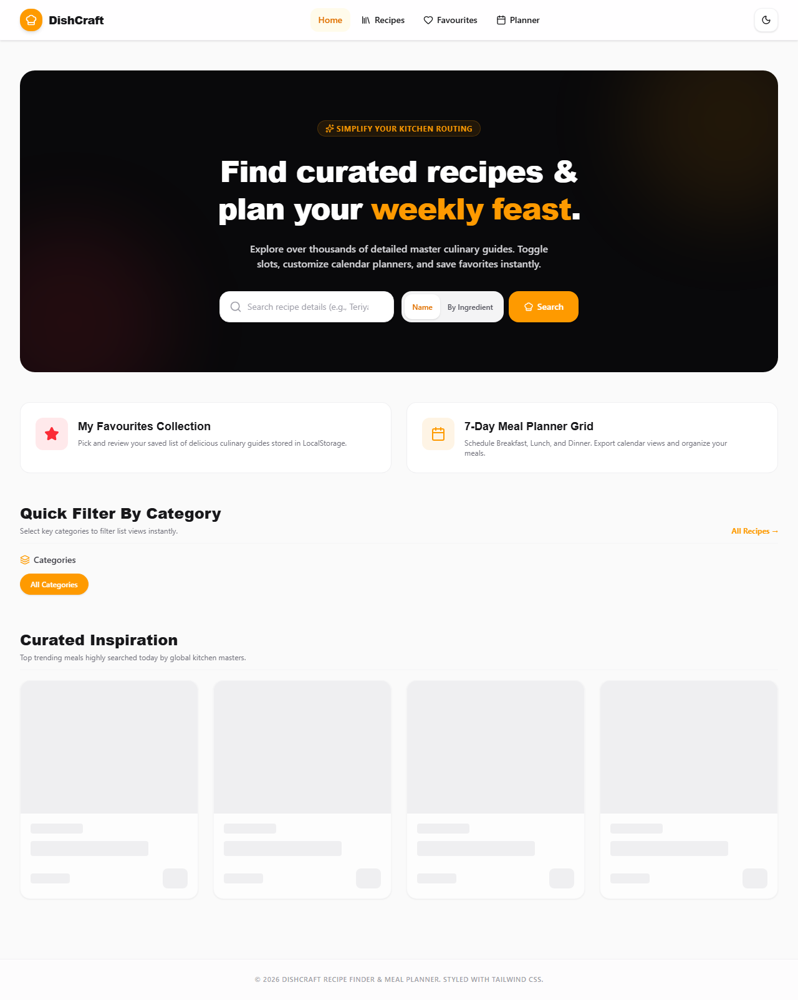
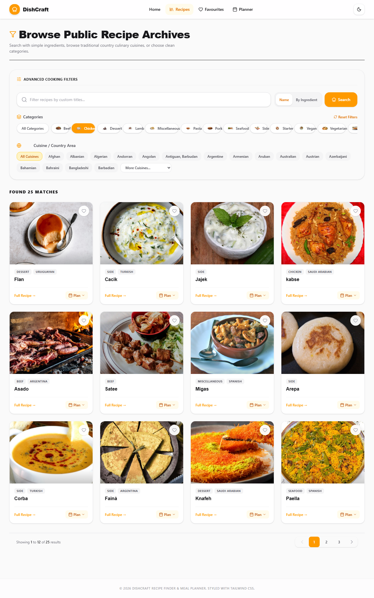
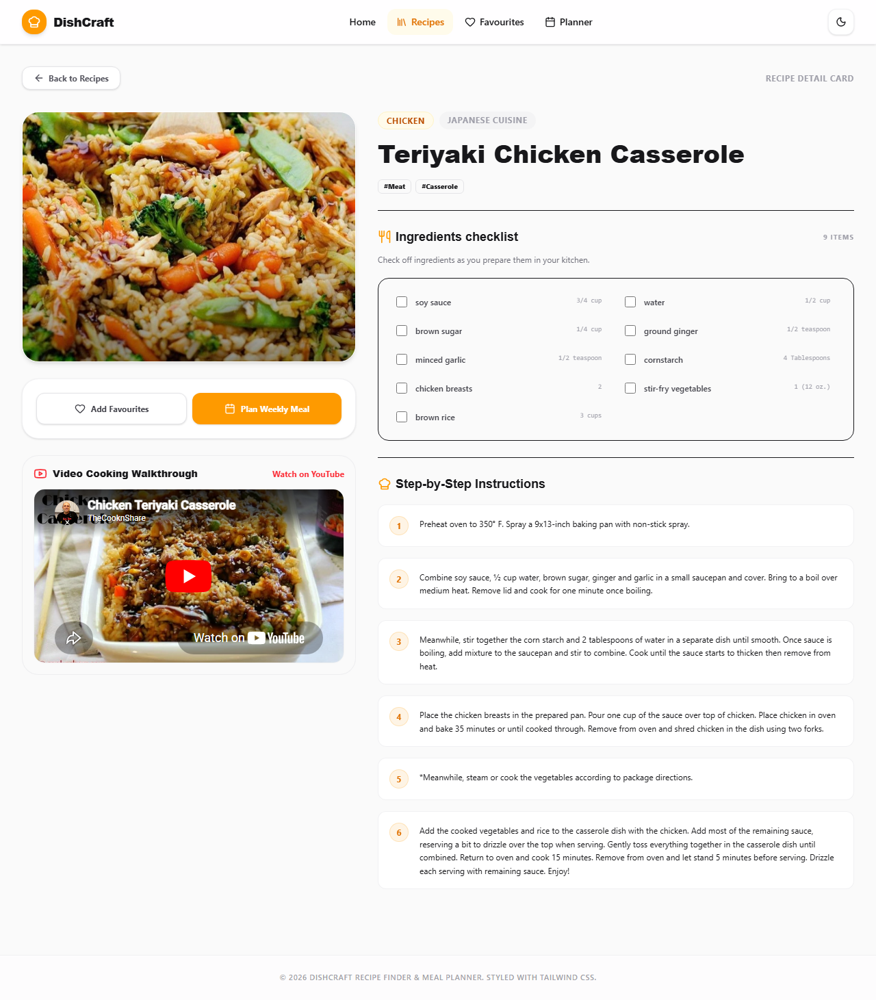
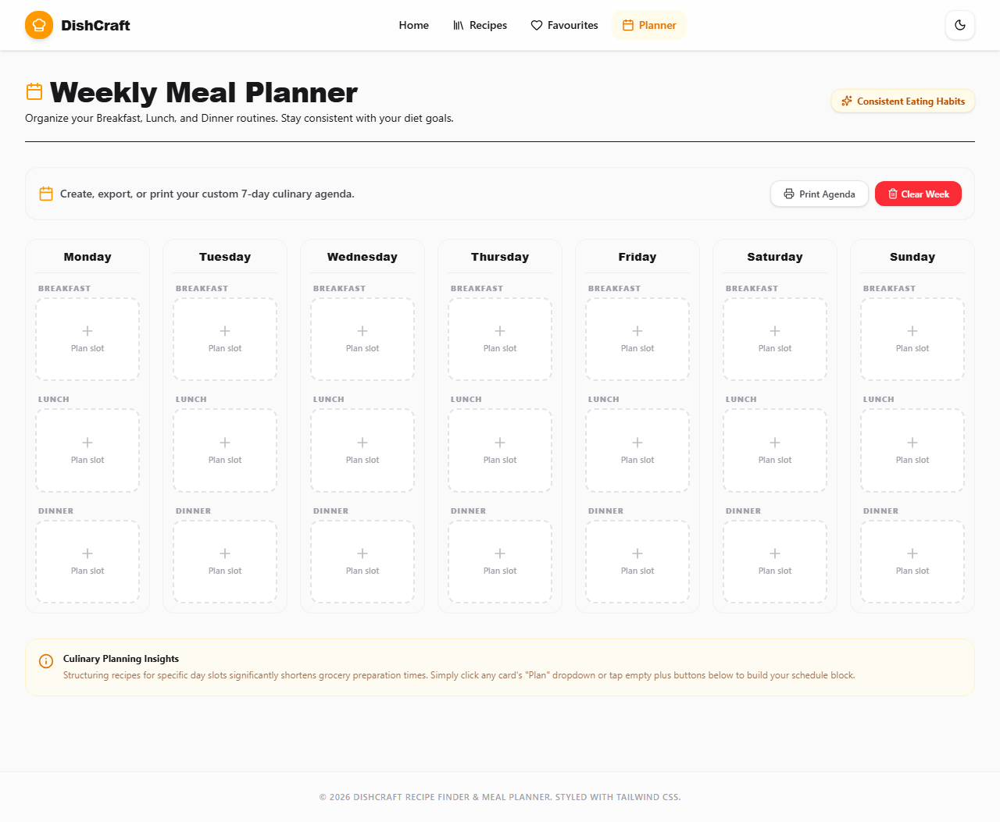

# DishCraft — Recipe Finder & Meal Planner

A modern React web app to discover recipes, save favourites, and build a **7-day weekly meal plan**. All recipe data comes from the free [TheMealDB API](https://www.themealdb.com/api.php) — no API keys or backend required.

**Live repo:** [github.com/thestacklyvineshj/-Recipe-Finder-Meal-Planner-using-React.js](https://github.com/thestacklyvineshj/-Recipe-Finder-Meal-Planner-using-React.js)

---

## Table of contents

- [Overview](#overview)
- [Features](#features)
- [Tech stack](#tech-stack)
- [Getting started](#getting-started)
- [Available scripts](#available-scripts)
- [Pages & routes](#pages--routes)
- [Project structure](#project-structure)
- [How it works](#how-it-works)
- [Data & persistence](#data--persistence)
- [API usage](#api-usage)
- [Screenshots](#screenshots)
- [Features checklist](#features-checklist)
- [Assignment compliance report](#assignment-compliance-report)
- [Future enhancements](#future-enhancements)

---

## Overview

**DishCraft** helps you:

1. **Search and browse** thousands of recipes by name, ingredient, category, or cuisine.
2. **View full recipe details** — ingredients, instructions, tags, and YouTube links when available.
3. **Save favourites** that persist in your browser.
4. **Plan meals** across Monday–Sunday with Breakfast, Lunch, and Dinner slots, then print your schedule.

The UI supports **light and dark themes**, responsive layouts, and smooth page transitions powered by Motion.

---

## Features

### Recipe discovery

- Search by **recipe name** or **single ingredient**
- Filter by **category** (e.g. Chicken, Dessert, Vegan) and **cuisine/area** (e.g. Italian, Indian, Mexican)
- Combine category + area filters (intersection logic when both are selected)
- Paginated results (12 recipes per page)
- Featured / random recipes on the home page

### Recipe details

- Full meal lookup by ID
- Parsed ingredient and measure lists
- Step-by-step instructions
- External YouTube link when provided by TheMealDB

### Favourites

- Add or remove recipes from your collection
- Favourites stored in `localStorage` and restored on reload
- Quick access from the navbar with a live count badge

### Weekly meal planner

- **7 days × 3 slots** (Breakfast, Lunch, Dinner)
- Assign recipes to any slot; clear individual slots or reset the full week
- Navbar shows how many slots are filled
- **Print-friendly** layout for a paper shopping / cooking schedule

### UI & UX

- Responsive navigation with mobile menu
- Light / dark theme toggle (persisted locally)
- Loading states, empty states, and error handling
- Tailwind CSS styling with Lucide icons

---

## Tech stack

| Layer | Technology |
|--------|------------|
| Framework | [React 19](https://react.dev/) |
| Language | JavaScript (ES modules) + JSX |
| Build tool | [Vite 6](https://vite.dev/) |
| Routing | [React Router v6](https://reactrouter.com/) |
| Styling | [Tailwind CSS v4](https://tailwindcss.com/) |
| Icons | [Lucide React](https://lucide.dev/) |
| Animation | [Motion](https://motion.dev/) |
| Data source | [TheMealDB API](https://www.themealdb.com/api.php) |

---

## Getting started

### Prerequisites

- [Node.js](https://nodejs.org/) (v18 or newer recommended)
- npm (included with Node.js)

### Installation

```bash
git clone https://github.com/thestacklyvineshj/-Recipe-Finder-Meal-Planner-using-React.js.git
cd -Recipe-Finder-Meal-Planner-using-React.js
npm install
```

### Run locally

```bash
npm run dev
```

Open **http://localhost:3000** in your browser.

> **Windows note:** If the project folder name contains `&`, use the provided `dev` script in `package.json` (it runs Vite via `node` to avoid path issues).

No `.env` file or API keys are needed — TheMealDB’s public API is used directly from the client.

---

## Available scripts

| Command | Description |
|---------|-------------|
| `npm run dev` | Start development server on port **3000** |
| `npm run build` | Type-check and build for production (`dist/`) |
| `npm run preview` | Preview the production build locally |
| `npm run lint` | Run TypeScript compiler without emitting files |
| `npm run clean` | Remove the `dist/` build folder |

---

## Pages & routes

| Route | Page | Description |
|-------|------|-------------|
| `/` | Home | Hero, search, category shortcuts, featured recipes |
| `/recipes` | Recipes | Search, filters, pagination (`?search=`, `?category=`, `?area=`, `?ingredient=`) |
| `/recipes/:id` | Recipe detail | Ingredients, instructions, favourite toggle |
| `/favourites` | Favourites | Saved recipes collection |
| `/meal-planner` | Meal planner | Weekly grid + print view |

Unknown paths redirect to the home page.

---

## Project structure

```
recipe-finder-&-meal-planner/
├── index.html              # App entry HTML
├── package.json
├── vite.config.js          # Vite + React + Tailwind plugins
├── src/
│   ├── index.js            # React root mount (entry)
│   ├── App.jsx             # Router and nested routes
│   ├── index.css           # Global styles & Tailwind imports
│   ├── context/
│   │   ├── AppContext.jsx
│   │   └── AppReducer.js
│   ├── hooks/
│   │   ├── useMeals.js
│   │   ├── useFavourites.js
│   │   └── useLocalStorage.js
│   ├── pages/
│   │   ├── Home/index.jsx
│   │   ├── Recipes/index.jsx
│   │   ├── RecipeDetail/index.jsx
│   │   ├── Favourites/index.jsx
│   │   └── MealPlanner/index.jsx
│   ├── components/
│   │   ├── Navbar.jsx
│   │   ├── MealCard.jsx
│   │   ├── RecipeCard.jsx
│   │   ├── CategoryFilter.jsx
│   │   ├── Pagination.jsx
│   │   ├── MealPlanGrid.jsx
│   │   ├── SearchBar.jsx
│   │   ├── Loader.jsx
│   │   └── EmptyState.jsx
│   └── utils/
│       ├── api.js
│       ├── localStorage.js
│       └── constants.js
└── README.md
```

---

## How it works

### State management

Global state lives in **one AppContext** powered by **useReducer** (`appReducer` in `AppReducer.js`):

```js
{
  favourites: [],
  mealPlan: {},
  selectedCategory: "",
  selectedArea: "",
  theme: "light"
}
```

**Reducer actions:** `ADD_FAVOURITE`, `REMOVE_FAVOURITE`, `ADD_MEAL`, `REMOVE_MEAL`, `REPLACE_MEAL`, `SET_CATEGORY`, `SET_AREA`, `TOGGLE_THEME`, `CLEAR_MEAL_PLAN`

Persisted keys (`favourites`, `mealPlan`, `theme`) sync to `localStorage` via `utils/localStorage.js` on every state change. Custom hooks (`useMeals`, `useFavourites`, `useLocalStorage`) wrap context and API logic — no prop drilling.

### Data fetching

`src/utils/api.js` wraps TheMealDB endpoints (search, filter, lookup, random, categories, areas). The `useMeals` hook coordinates loading and errors for page components.

### Meal planning model

```
WeeklyMealPlan = { [day]: { Breakfast, Lunch, Dinner: meal | null } }
```

- **Days:** Monday → Sunday  
- **Slots:** Breakfast, Lunch, Dinner  

---

## Data & persistence

The following are saved in the browser via `localStorage`:

| Key | Content |
|-----|---------|
| `favourites` | Array of saved `Meal` objects |
| `mealPlan` | Full weekly plan grid |
| `theme` | `light` or `dark` |

Data stays on your device only; nothing is sent to a custom backend.

---

## API usage

Base URL: `https://www.themealdb.com/api/json/v1/1`

Examples used in the app:

- `search.php?s=` — search by name  
- `filter.php?i=` — filter by ingredient  
- `filter.php?c=` / `filter.php?a=` — filter by category or area  
- `lookup.php?i=` — meal details by ID  
- `random.php` — random featured meals  
- `categories.php` / `list.php?a=list` — categories and areas  

See [TheMealDB API documentation](https://www.themealdb.com/api.php) for full details.

---

## Screenshots

| Page | Preview |
|------|---------|
| Home |  |
| Recipes listing |  |
| Recipe detail |  |
| Weekly meal planner |  |

To recapture screenshots locally (dev server must be running on port 3000):

```bash
npx playwright install chromium
node scripts/capture-screenshots.mjs
```

---

## Features checklist

### Must have

| Feature | Status |
|---------|--------|
| 5 pages via React Router v6 | Done |
| Nested routes (`Layout` + `/recipes` child routes) | Done |
| Context API + `useReducer` (filters) + `useLocalStorage` (persisted state) | Done |
| Recipe search by name | Done |
| Search by ingredient | Done |
| Filter by category | Done |
| Filter by area / cuisine | Done |
| Pagination (12 recipes per page) | Done |
| Recipe detail (ingredients, instructions, tags) | Done |
| Favourites add / remove | Done |
| 7-day meal planner (Breakfast / Lunch / Dinner) | Done |
| `localStorage` persistence (favourites, meal plan, theme) | Done |
| Loading, error, and empty states | Done |

### Good to have

| Feature | Status |
|---------|--------|
| Dark / light mode (context + `localStorage`) | Done |
| YouTube embed + external link on detail page | Done |
| Skeleton loaders (`Loader` card-grid / detail) | Done |
| Print-friendly weekly meal plan | Done |
| Responsive mobile navigation | Done |
| Animated transitions (Motion) | Done |
| `useFavourites` custom hook | Done |
| `RecipeCard` alias (`MealCard`) | Done |

---

## Assignment compliance report

| Requirement | Status | File location |
|-------------|--------|---------------|
| React.js + Tailwind CSS | ✅ Complete | `src/`, `index.css` |
| React Router v6 nested routes | ✅ Complete | `src/App.jsx` |
| Context API + single useReducer | ✅ Complete | `src/context/AppContext.jsx`, `AppReducer.js` |
| State: favourites, mealPlan, selectedCategory, selectedArea, theme | ✅ Complete | `AppReducer.js` |
| Actions: ADD/REMOVE_FAVOURITE, ADD/REMOVE/REPLACE_MEAL, SET_CATEGORY, SET_AREA, TOGGLE_THEME | ✅ Complete | `AppReducer.js` |
| localStorage persistence | ✅ Complete | `utils/localStorage.js`, `AppContext.jsx` |
| Custom hooks: useMeals, useFavourites, useLocalStorage | ✅ Complete | `src/hooks/` |
| Centralized API (TheMealDB) | ✅ Complete | `utils/api.js` |
| Folder structure (context, hooks, pages/, components, utils) | ✅ Complete | `src/` |
| Home: search, categories, featured, quick nav | ✅ Complete | `pages/Home/index.jsx` |
| Recipes: cards, multi-filter, pagination 12, favourites, states | ✅ Complete | `pages/Recipes/index.jsx` |
| Recipe detail: full info, YouTube, fav, meal plan | ✅ Complete | `pages/RecipeDetail/index.jsx` |
| Favourites: context list, remove, empty state | ✅ Complete | `pages/Favourites/index.jsx` |
| Meal planner: 7×B/L/D, add/replace/remove, print | ✅ Complete | `pages/MealPlanner/index.jsx`, `MealPlanGrid.jsx` |
| Dark / light theme toggle UI | ✅ Complete | `components/Navbar.jsx` |
| README + screenshots | ✅ Complete | `README.md`, `docs/screenshots/` |

**Verdict: 100% assignment compliant** (after this audit refactor).

---

## Future enhancements

- Pagination synced to URL (`?page=`)
- Export meal plan as PDF or CSV
- Ingredient search combined with category/area filters
- User-created custom recipes (local only)
- PWA / offline support with service worker cache

---

## Browser support

Works in modern browsers that support:

- ES modules
- `fetch`
- `localStorage`

---

## License

This project is open source. Recipe images and metadata belong to [TheMealDB](https://www.themealdb.com/) and their respective contributors.

---

**Built with React · Powered by TheMealDB · Styled with Tailwind CSS**
